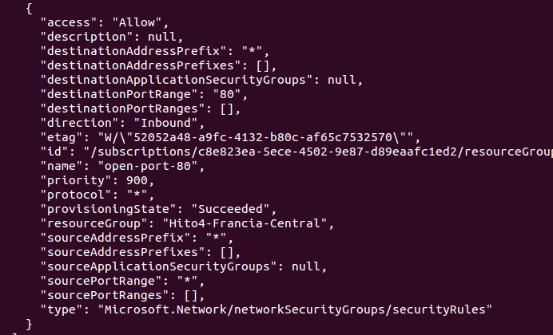
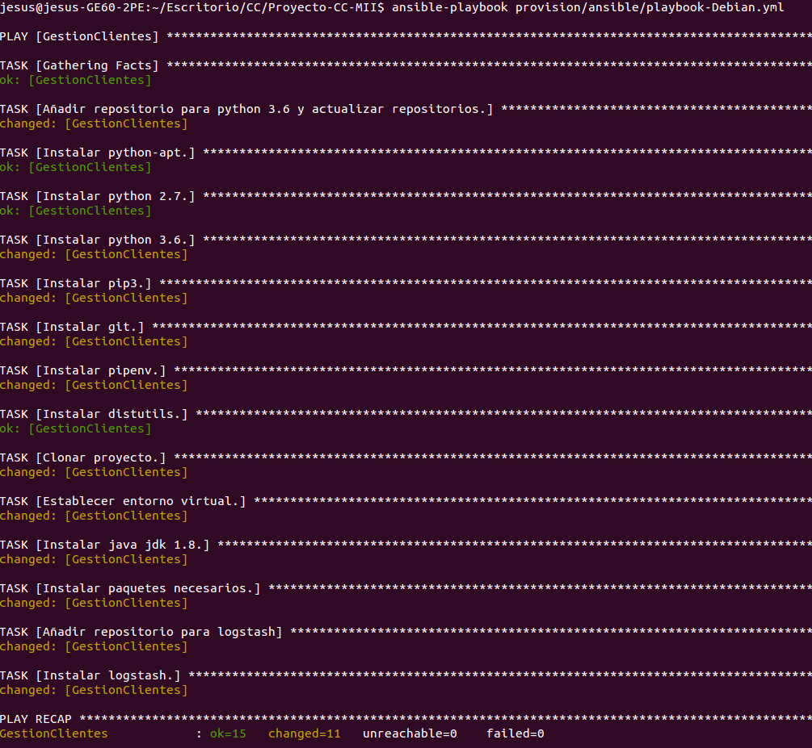
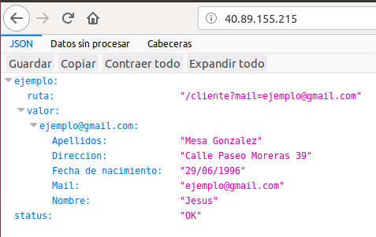

## Automatización de la creación de una máquina virtual

Una vez elegida la imagen y el centro de datos para la MV, vamos a crear un script sh llamado acopio en el cual se encontrarán los comandos de el CLI moderno de Azure (az) necesarios para crear la MV en la cual se desplegará nuestra aplicación.

Lo primero que debemos hacer es instalar el CLI de azure. Para ello, en primer lugar modificamos la lista de orígenes ejecutando los comandos siguientes.

~~~
$ sudo apt-get install apt-transport-https lsb-release software-properties-common -y
AZ_REPO=$(lsb_release -cs)
$ echo "deb [arch=amd64] https://packages.microsoft.com/repos/azure-cli/ $AZ_REPO main" | \
    sudo tee /etc/apt/sources.list.d/azure-cli.list
~~~

Tras esto obtenemos la clave de firma de microsoft.

~~~
$ sudo apt-key --keyring /etc/apt/trusted.gpg.d/Microsoft.gpg adv \
     --keyserver packages.microsoft.com \
     --recv-keys BC528686B50D79E339D3721CEB3E94ADBE1229CF
~~~

Finalmente instalamos el CLI de Azure.

~~~
$ sudo apt-get update
$ sudo apt-get install azure-cli
~~~

Para instalar el CLI en otros sistemas se puede consultar el siguiente [enlace](https://docs.microsoft.com/es-es/cli/azure/install-azure-cli?view=azure-cli-latest).

Una vez instalado el CLI podemos proceder con la creación del script, pero antes tendremos que logearnos en el CLI Azure con nuestro correo y contraseña de Azure ejecutando el comado siguiente.

~~~
$ az login
~~~

### Creación de la MV

En primer lugar debemos crear un grupo de recursos para alojar la MV. Como se dijo en la [elección del centro de datos](https://github.com/mesagon/Proyecto-CC-MII/blob/master/docs/hito4/eleccionCentroDatos.md#elecci%C3%B3n-del-centro-de-datos), el grupo de recursos debe de estar situado en Francia Central. Esto lo hacemos con el siguiente comando.

~~~
$ az group create --location francecentral --name Hito4-Francia-Central  
~~~

Este comando nos crea un grupo de recursos llamado Hito4-Francia-Central, situado en el centro de datos del centro de Francia.

Tras esto, podemos crear la MV con el siguiente comando.

~~~
$ az vm create --resource-group Hito4-Francia-Central --name GestionClientes
--image credativ:Debian:9:9.0.201808270 --admin-username azureuser
--ssh-key-value ~/.ssh/id_rsa.pub --size Basic_A1
--public-ip-address-allocation static
~~~

Vemos que utilizamos el comando $ az vm create para crear la MV junto a bastantes parámetros, los cuales, establecen la configuración concreta de la MV. Vamos a verlos con más detalle.

- resource-group: Indica el grupo de recursos donde alojar la MV. En este caso, la alojamos en el grupo de recursos Hito4-Francia-Central anteriormente creado.
- name: Es el nombre con el que identificaremos a la MV.
- image: Imagen a instalar en la MV identificado por su urn (también puede ser por su alias). Hemos utilizado la imagen de Debian 9 elegida en base a lo comentado en la [elección d la imagen](https://github.com/mesagon/Proyecto-CC-MII/blob/master/docs/hito4/eleccionSo.md#elecci%C3%B3n-de-la-imagen).
- admin-username: Es el nombre del usuario con derechos de administrador de la MV. En este caso será azureuser.
- ssh-key-value: En este parámetro indicamos la ruta a nuestra clave pública en nuestro ordenador. Esto lo hacemos para que Azure cree la MV y copie dicha clave pública en ella en el directorio correspondiente del usuario con derechos de administrador. Así, podremos acceder mediante ssh a la MV identificados como azureuser.
- size: Indica el tamaño de nuestra MV en Azure. En este caso hemos elegido el tamaño Basic_A1 el cual nos proporciona 1 CPU, 1,75 GB de RAM y 2 discos de datos. Se ha elegido este tamaño debido a que es el mínimo tamaño que necesitamos para desplegar nuestra aplicación. Se quería elegir en principio el tamaño Basic_A0 (el más básico) paro solo nos porporciona 1 GB de RAM, lo cual no nos basta ya que logstash consume más memoria principal (al menos en Debian 9).
- public-ip-address-allocation: Indica el tipo de IP de la MV (estático o dinámico). En este caso elegimos que la IP de la MV sea estática para que entre reinicios no se cambie.

Tras todo esto tenemos que habilitar el puerto 80 de la MV creada, pues por defecto, al crear una MV en Azure, esta solo tendrá abierto el puerto 22. Para ello, ejecutamos el siguiente comando.

~~~
az vm open-port --port 80 --resource-group Hito4-Francia-Central --name GestionClientes
~~~

Tras esto, abriremos el puerto 80 de la MV y podremos acceder a nuestra aplicación (cuando esté desplegada), la cual escucha a través de dicho puerto.

### Creación del script, provisionamiento y despliegue

Finalmente creamos el script llamado acopio.sh, el cual ejecutará en orden las tres ordenes anteriores. Dicho script es el siguiente.

~~~
#!/bin/bash

# Crear grupo de recursos.
echo "Creando grupo de recursos."
az group create --location francecentral --name Hito4-Francia-Central

# Crear la máquina virtual.
echo "Creando maquina virtual."
az vm create --resource-group Hito4-Francia-Central
--name GestionClientes --image credativ:Debian:9:9.0.201808270
--admin-username azureuser --ssh-key-value ~/.ssh/id_rsa.pub --size Basic_A1
--public-ip-address-allocation static

# Abrir el puerto 80.
echo "Abriendo el puerto 80."
az vm open-port --port 80 --resource-group Hito4-Francia-Central
--name GestionClientes
~~~

Vemos como antes de cada comando, el script muestra un mensaje con la orden $ echo al usuario para indicarle que tarea está realizando en cada momento.

Al ejecutar el script ($ ./acopio.sh) para crear la MV obtenemos lo siguiente.

En esta imagen podemos ver el mensaje que nos devuelve Azure tras crear el grupo de recursos. Dicho mensaje está en formato JSON y el valor "Succeeded" de la clave "provisioningState", nos indica que el grupo de recursos se ha creado con éxito.

En la imagen anterior podemos ver el mensaje en formato JSON que se nos muestra cuando creamos la MV con éxito. Vemos varios detalles de dicha MV como su IP pública y privada, el grupo de recursos y la localización. De esta forma confirmamos que la MV se ha creado con los parámetros especificados. Por otra parte, podemos ver que al ejecutar este comando la máquina virtual se está ejecutando (clave "powerState").

Por último, tras abrir el puerto 80, se no mostrará un mensaje JSON bastante grande, en el cual tenemos que fijarnos en su última parte (clave "provisioningState") para confirmar que el puerto 80 se ha abierto con éxito. Esta parte es la siguiente.

Una vez ejecutado el script, tenemos la MV creada, ejecutándose y lista para provisionarla. Para ello ejecutamos nuestro [playbook de provisionamiento para Debian](https://github.com/mesagon/Proyecto-CC-MII/blob/master/provision/ansible/playbook-Debian.yml) obteniendo lo siguiente.

Vemos como el provisionamiento se realiza correctamente sobre la MV recién creada. Además, vemos las nuevas tareas añadidas para instalar logstash (las cuatro últimas).

Tras esto, accedemos mediante ssh a la MV utilizando su IP con el siguiente comando.

~~~
$ ssh azureuser@40.89.155.215
~~~

Con esto entraremos a la MV como azureuser. Una vez allí accedemos a la carpeta Proyecto-CC-MII, que es donde se encuentra la aplicación. En primer lugar ejecutamos los tests con.

~~~
$ pipenv run python3 test/test.py
~~~

Si se ejecutan correctamente ejecutamos gunicorn para desplegar el microservicio.

~~~
$ pipenv run gunicorn --log-config gunicorn-logging.conf --reload -D -b 0.0.0.0:80 app:app
~~~

Con este comando lanzamos mediante gunicorn el microservicio. Aquí vemos los siguientes parámetros:

- log-config: En este parámetro indicamos el archivo de configuración de logs que debe utilizar gunicorn. En este caso le pasamos el fichero gunicorn-logging.conf que hemos creado para que los logs de gunicorn se envíen a logstash.
- reload: Sirve para redesplegar el microservicio en caso de que se modifique.
- D: Lanza gunicorn como un proceso demonio.
- -b: IP y puerto por los que escuchar. 0.0.0.0 significa que aceptamos peticiones desde cualquier IP.
- app: Nombre del archivo donde se encuentra el microservicio a ejecutar.

Una vez desplegado el microservicio, lanzamos logstash para que realice la gestión de logs con el comando.

~~~
$ /usr/share/logstash/bin/logstash -f logstash.conf
~~~

Vemos que le pasamos a logstash con el parámetro -f el fichero de configuración, donde declaramos de donde leemos los logs y donde los almacenamos.

Tras esto, si accedemos en el navegador a la dirección IP de la MV creada, comprobaremos que el microservicio está desplegdo correctamente.

En la imagen vemos que al acceder a la IP de la MV desde el navegador, accedemos a la ruta / del microservicio, el cual nos devuelve un JSON que contiene el par clave-valor status:"OK", confirmando que el microservicio se ha desplegado correctamente.
